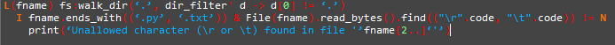

# 11l Editor
It's a non-official editor and syntax highlighter for 11l. It can help you read code and write it without making syntax errors. It can help you write code faster with the autocompletion. Also there is the dark theme (your eyes will thank you).
## Supported features
- Syntax highlighting
- Writing pared quotes ‘ on alt+9 and ’ on alt+0
- Autocompletion(on ctrl+space)
- Uploading and saving files
- Dark and light themes
- 11l Documentation search(on F1+Enter, while selecting a function or module in autocompletion menu)
## Example
An example from [11l official site](http://11l-lang.org/)
```
L(fname) fs:walk_dir(‘.’, dir_filter' d -> d[0] != ‘.’)
   I fname.ends_with((‘.py’, ‘.txt’)) & File(fname).read_bytes().find(("\r".code, "\t".code)) != N
      print(‘Unallowed character (\r or \t) found in file '’fname[2..]‘'’)
```
Will be look like this in 11l Editor

